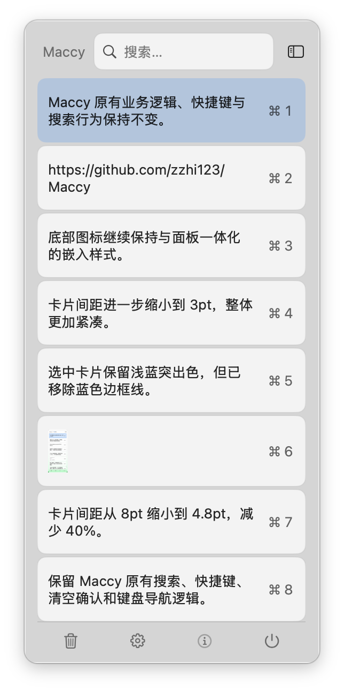

# Maccy Card UI

本仓库 Fork 自开源剪贴板工具 [p0deje/Maccy](https://github.com/p0deje/Maccy)。
项目保留原版 Maccy 的核心功能，仅重新设计剪贴板弹窗的 SwiftUI 展示样式。

## 主要改动

- 弹窗宽度调整为紧凑的 275.4pt。
- 剪贴内容改为圆角卡片布局，卡片间距缩小至 3pt。
- 选中或悬停时保留突出色，但移除外框描边。
- 清空、设置、关于和退出以四个原生图标嵌入底部面板。
- 使用 macOS 原生颜色和 SF Symbols，适配系统外观。

以上改动仅涉及界面展示。剪贴板记录、搜索、粘贴、快捷键、确认操作、
设置和键盘导航等业务逻辑均保持原版实现。

## 下载

从 [Releases](https://github.com/zzhi123/Maccy/releases/latest) 下载本 Fork 的构建版本。
当前构建支持 macOS Sonoma 14 或更高版本。

## 原项目与许可

- 原项目：[p0deje/Maccy](https://github.com/p0deje/Maccy)
- 原项目官网：[maccy.app](https://maccy.app)
- 开源许可：[MIT](LICENSE)
